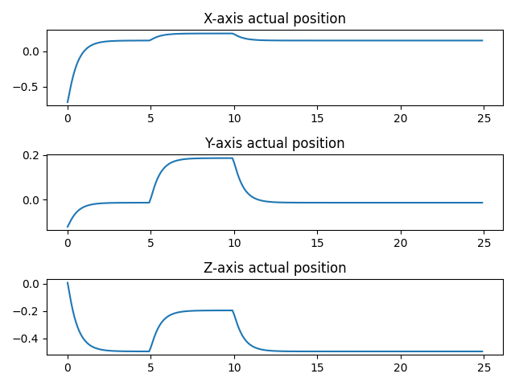

## Admittance Control

This class represents the admittance control. In order to use it, the parameters for the second order spring
have to be entered as well the initial position and the desired position. 

The method "step" simulates a step in the admittance control. In each step the desired position can bechanged
and each new position can be stored. 

The method "get_stored_values" gives the access to these stored values. 

The method "load_parameter_matrix" allows to change the parameters of the second order spring.

In main.py there's an example how to use it as well how to print a graphic of each executed
step by the admittance control. This example also shows how to work only with the position. For changing this,
change the "only_position" value.

Result of the example:

