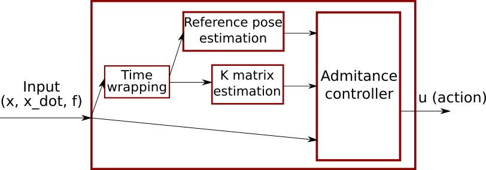

# Controller design

    

Controller structure

The controller will perfom the following actions:
- Detect the part of the path in which the robot is, according to the time wrapping module.
- Estimate the reference pose for that step
- Estimate the M, D, K matrixes of the controller based on the model found through GMM, GMR, ...
- Use all the previous parameters and the current output to calculate the required action for the controller.

## ROS subscribers and publishers (**TODO**)
