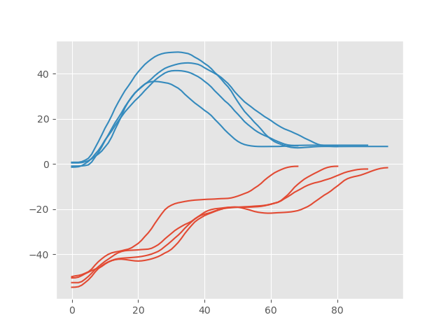

# GMM+GMR full use example
References: 
https://calinon.ch/codes.htm

https://scikit-learn.org/stable/modules/generated/sklearn.mixture.BayesianGaussianMixture.html

### Pages related:

[Bayesian Gaussian mixture model for robotic policy imitation](https://gitlab.idiap.ch/rli/pbdlib-python/blob/master/pop/readme.md)

[Variational Inference with Mixture Model Approximation for Applications in Robotics](https://gitlab.idiap.ch/rli/pbdlib-python/blob/master/vmm/readme.md)


## Import python modules


```python
import numpy as np
import matplotlib.pyplot as plt
from gaussian_mixture_regression import train_and_return_1D, train_and_return_PD, train_and_return_PD_connected
from generate_fake_data import load_data
```

## Import and plot generated fake data

```python
X = load_data(plot=True, NPY=True, ret=True)
```




The shape of the data must be in the following format: 
[number of demonstrations, length of demonstation, numer of dimensions]

Very important: All demonstations must have the same length! And the time should already be normalized!
(even if the data is 1D)

```python
dem, len = X.shape
print(X.shape)
X = X[:, :, np.newaxis]
```

## Train 1D Gaussian mixture model

```python
time, X_1D = train_and_return_1D(X=X, gaus_num=10, out_dim=100)
```

When training the GMM we only need to input the data, numer of
Gaussians and the output dimensions we expect to have. The time will be 
generated automatically from the size of the demonstrations. 

The shape of the output will be a one dimension array with the size that
was asked from the 'out_dim' parrameter.

## Train Multiple independent Dimensions Gaussian mixture model (recommended) 

```python
time, X_PD = train_and_return_PD(X=X, gaus_num=10, out_dim=100)
```

Everything stated for the one dimension function is still applied in this section as well. 

The only difference here is that the output is not only one dimension array but a array with the shape
[out_dim, numer of dimensions]

## Train Multiple dependent Dimensions Gaussian mixture model 

```python
time, X_PD_con = train_and_return_PD_connected(X=X, gaus_num=10, out_dim=100)
```

The main difference between the independend one and this one is the way of treating the variables.
After a couple of test the results seem to be more stable and accurate when we treat them independently. 

